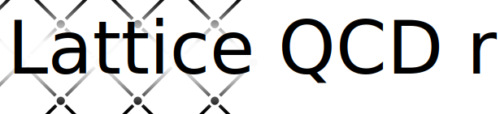

<!-- cspell: ignore Serde xoshiro PRNG CSPRNG ranlux codecov usize -->
# 


[](https://abouttefeux.github.io/lattice-qcd-rs/lattice_qcd_rs/index.html)


[](https://codecov.io/gh/ABouttefeux/lattice-qcd-rs)

## Classical lattice QCD simulation and tools.

This library provides tool to simulate a pure gauge SU(3) theory on a lattice. It aimed to provide generic tool such that many different simulation or methods can be used.
You can easily choose the Monte Carlo algorithm, you can implement you own Hamiltonian etc. It provides also an easy way to do simulation in dimension between 1 and 128. So this library is not limited to d = 3 or d = 4.

Check out my other repo [plaquette](https://github.com/ABouttefeux/plaquette), a set of simulation binary I used for my research.

**Features**:
- Generic dimension;
- Configurable Monte Carlo algorithm;
- Multi Platform;
- Configurable Hamiltonian;
- Serde support;
- Native rust;
- Some statistical tools;

**Not yet implemented features**:

- More statistical tools;
- Fermion support;
- SU(N) support;
- Config file;
- C friendly API / ABI;

## Usage

The library may use feature of the latest **stable** release. I do not intend to use any nightly feature.

Add `lattice_qcd_rs = { version = "0.3.0", git = "https://github.com/ABouttefeux/lattice_qcd_rs" }` into your `cargo.toml`.
The set of features are 
 - `serde-serialize` on by default permit the use of serde on some structure
 - `no-overflow-test` usage interns to disable overflow test for coverage.

First let us see how to do a simulation on a 10x10x10x10 lattice with `beta = 1`. We are looking to compute `1/3 <Re(Tr(P_{ij}))>` the trace of all plaquette after a certain number of steps. In our cases Beta is small so we choose 100'000 steps.

```rust,ignore
extern crate lattice_qcd_rs as lq;
extern crate rand_xoshiro;

use lq::prelude::*;

# use std::error::Error;
# fn main() -> Result<(), Box<dyn Error>> {
    let mut rng = rand_xoshiro::Xoshiro256PlusPlus::from_entropy();

    let size = 1000_f64;
    let number_of_pts = 10;
    let beta = 1_f64;

    let mut simulation =
        LatticeStateDefault::<4>::new_determinist(size, beta, number_of_pts, &mut rng)?;

    let spread_parameter = 0.1_f64;
    let mut mc = MetropolisHastingsDeltaDiagnostic::new(spread_parameter, rng)?;

    for _ in 0..100 {
        for _ in 0..1_000 {
            simulation = simulation.monte_carlo_step(&mut mc)?;
        }
        // the more we advance te more the link matrices
        // will deviate form SU(3), so we reproject to SU(3)
        // every 1_000 steps.
        simulation.normalize_link_matrices();
    }

    let average = simulation.average_trace_plaquette().ok_or(ImplementationError::Unreachable)?.real() / 3_f64;
# Ok(())
# }
```

This library use rayon as a way to do some computation in parallel. However not everything can be parallelized. I advice that if you want to do multiple similar simulation (for instance you want to do for `beta = 1, 1.1, 1.2, ...`) to use rayon. In order to do multiple parallel simulation.

Looking for more concrete example ? Check out my other repo [plaquette](https://github.com/ABouttefeux/plaquette). It contain the binary I use for my research.

### I want to do my own thing.

#### I want to use my own hamiltonian

implement the trait [`LatticeState`](https://abouttefeux.github.io/lattice-qcd-rs/lattice_qcd_rs/simulation/state/trait.LatticeState.html).

If you want to use your own state with the [Hybrid Monte Carlo](https://abouttefeux.github.io/lattice-qcd-rs/lattice_qcd_rs/simulation/monte_carlo/hybride_monte_carlo/struct.HybridMonteCarloDiagnostic.html)
you will have to implement
[`LatticeStateWithEField`](https://abouttefeux.github.io/lattice-qcd-rs/lattice_qcd_rs/simulation/state/trait.LatticeStateWithEField.html) for [`LatticeStateEFSyncDefault<YourState>`](https://abouttefeux.github.io/lattice-qcd-rs/lattice_qcd_rs/simulation/state/struct.LatticeStateEFSyncDefault.html)

#### I want to use my own Monte Carlo algorithm.

I provide two algorithm: [Metropolis Hastings](https://abouttefeux.github.io/lattice-qcd-rs/lattice_qcd_rs/simulation/monte_carlo/metropolis_hastings/struct.MetropolisHastingsDeltaDiagnostic.html)
and [Hybrid Monte Carlo](https://abouttefeux.github.io/lattice-qcd-rs/lattice_qcd_rs/simulation/monte_carlo/hybride_monte_carlo/struct.HybridMonteCarloDiagnostic.html)

Look at the traits [`MonteCarlo`](https://abouttefeux.github.io/lattice-qcd-rs/lattice_qcd_rs/simulation/monte_carlo/trait.MonteCarlo.html),
or alternatively [`MonteCarloDefault`](https://abouttefeux.github.io/lattice-qcd-rs/lattice_qcd_rs/simulation/monte_carlo/trait.MonteCarloDefault.html).

[`MonteCarloDefault`](https://abouttefeux.github.io/lattice-qcd-rs/lattice_qcd_rs/simulation/monte_carlo/trait.MonteCarloDefault.html) can be easier to implement but note that the entire Hamiltonian is computed each time we do step for the previous and the new one which can be slower to compute the delta Hamiltonian.

To use a [`MonteCarloDefault`](https://abouttefeux.github.io/lattice-qcd-rs/lattice_qcd_rs/simulation/monte_carlo/trait.MonteCarloDefault.html) as a [`MonteCarlo`](https://abouttefeux.github.io/lattice-qcd-rs/lattice_qcd_rs/simulation/monte_carlo/trait.MonteCarlo.html) there is a wrapper: [`MCWrapper`](https://abouttefeux.github.io/lattice-qcd-rs/lattice_qcd_rs/simulation/monte_carlo/struct.MCWrapper.html).


## Why ?

This some code for my PhD thesis.
Mainly I use [arXiv:0707.2458](https://arxiv.org/abs/0707.2458), [arXiv:0902.28568](https://arxiv.org/abs/0707.2458) and [arXiv:2010.07316](https://arxiv.org/abs/2010.07316) as a basis.

## Goal

The goal is to provide an easy to use, fast and safe library to do classical lattice simulation.

## Discussion about Random Number Generators (RNGs)

This library use the trait [`rand::RngCore`](https://docs.rs/rand/0.8.3/rand/trait.RngCore.html) any time a random number generator.
The choice of RNG is up to the user of the library. However there is a few trade offs to consider.

Let us break the different generator into categories.
For more details see <https://rust-random.github.io/book/guide-gen.html>.

Some of the possible choice :
- **Recommended** [`rand_xoshiro::Xoshiro256PlusPlus`](https://docs.rs/rand_xoshiro/0.6.0/rand_xoshiro/struct.Xoshiro256PlusPlus.html)
Non-cryptographic. It has good performance and statistical quality, reproducible, and has useful `jump` function.
It is the recommended PRNG.
- [`rand::rngs::ThreadRng`](https://docs.rs/rand/0.8.3/rand/rngs/struct.ThreadRng.html) a CSPRNG. The data is not reproducible and it is reseeded often. It is however slow.
- [`rand::rngs::StdRng`](https://docs.rs/rand/0.8.3/rand/rngs/struct.StdRng.html) cryptographic secure, can be seeded.
It is determinist but not reproducible between platform. It is however slow.
- [`rand_jitter::JitterRng`](https://docs.rs/rand_jitter/0.3.0/rand_jitter/) True RNG but very slow.

Also [ranlux](https://luscher.web.cern.ch/luscher/ranlux/) is a good choice. But there is no native rust implementation of it that I know of
(except mine but it is very slow).

# Other Examples
```rust
use lattice_qcd_rs::{
    error::ImplementationError,
    ComplexField,
    simulation::monte_carlo::MetropolisHastingsDeltaDiagnostic,
    simulation::state::{LatticeState, LatticeStateDefault},
};

# use std::error::Error;
# fn main() -> Result<(), Box<dyn Error>> {
let mut rng = rand::thread_rng();

let size = 1_000_f64;
let number_of_pts = 4;
let beta = 2_f64;
let mut simulation =
    LatticeStateDefault::<4>::new_determinist(size, beta, number_of_pts, &mut rng)?;

let spread_parameter = 1E-5_f64;
let mut mc = MetropolisHastingsDeltaDiagnostic::new(spread_parameter, rng)
    .ok_or(ImplementationError::OptionWithUnexpectedNone)?;

let number_of_sims = 100;
for _ in 0..number_of_sims / 10 {
    for _ in 0..10 {
        simulation = simulation.monte_carlo_step(&mut mc)?;
    }
    simulation.normalize_link_matrices(); // we renormalize all matrices back to SU(3);
}
let average = simulation.average_trace_plaquette()
    .ok_or(ImplementationError::OptionWithUnexpectedNone)?
    .real();
# Ok(())
# }
```
Alternatively other Monte Carlo algorithm can be used like,
```rust
use lattice_qcd_rs::{
    error::ImplementationError,
    simulation::monte_carlo::{McWrapper, MetropolisHastingsDiagnostic},
    simulation::state::{LatticeState, LatticeStateDefault},
};

# use std::error::Error;
# fn main() -> Result<(), Box<dyn Error>> {
let mut rng = rand::thread_rng();

let size = 1_000_f64;
let number_of_pts = 4;
let beta = 2_f64;
let mut simulation =
    LatticeStateDefault::<3>::new_determinist(size, beta, number_of_pts, &mut rng)?;

let number_of_rand = 20;
let spread_parameter = 1E-5_f64;
let mut mc = McWrapper::new(
    MetropolisHastingsDiagnostic::new(number_of_rand, spread_parameter)
        .ok_or(ImplementationError::OptionWithUnexpectedNone)?,
    rng,
);

simulation = simulation.monte_carlo_step(&mut mc)?;
simulation.normalize_link_matrices();
# Ok(())
# }
```
or
```rust
use lattice_qcd_rs::{
    integrator::SymplecticEulerRayon,
    simulation::monte_carlo::HybridMonteCarloDiagnostic,
    simulation::state::{LatticeState, LatticeStateDefault},
};

# use std::error::Error;
# fn main() -> Result<(), Box<dyn Error>> {
let mut rng = rand::thread_rng();

let size = 1_000_f64;
let number_of_pts = 4;
let beta = 2_f64;
let mut simulation =
    LatticeStateDefault::<3>::new_determinist(size, beta, number_of_pts, &mut rng)?;

let delta_t = 1E-3_f64;
let number_of_step = 10;
let mut mc =
    HybridMonteCarloDiagnostic::new(delta_t, number_of_step, SymplecticEulerRayon::new(), rng);

simulation = simulation.monte_carlo_step(&mut mc)?;
simulation.normalize_link_matrices();
# Ok(())
# }
```